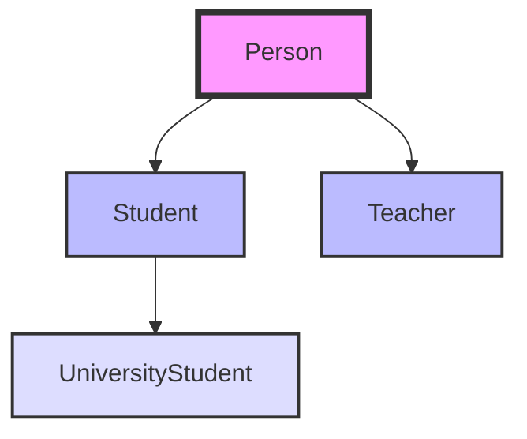

# 📘 Modulo 8 - Inheritance (Ereditarietà)


**Percorso:** `01_Fundamentals_Examples/Modulo8Ereditarietà/`


## 🎯 Cos'è l'Ereditarietà?

L'ereditarietà permette a una classe di ereditare attributi e metodi da un'altra classe:

<table>
<tr>
<td width="50%">

### 👨‍👦 Classe Genitore (Superclass)
- La classe da cui si eredita
- Contiene attributi e metodi comuni
- Definisce il comportamento base
- Esempio: `Person`

</td>
<td width="50%">

### 👶 Classe Figlia (Subclass)
- La classe che eredita
- Estende la funzionalità del genitore
- Aggiunge attributi/metodi specifici
- Esempio: `Student extends Person`

</td>
</tr>
</table>

---

## 🔑 Concetti Chiave

### ✨ Parola Chiave `extends`

```java
public class Student extends Person {
    // Student eredita TUTTI gli attributi e metodi di Person
    private String studentId;
    private int year;

    // Nuovi metodi specifici per Student
    public void study() {
        System.out.println("Sto studiando...");
    }
}
```

**Cosa eredita Student?**
- Tutti gli attributi `public` e `protected` di Person
- Tutti i metodi `public` e `protected` di Person
- Il comportamento base definito in Person

---

### 🌟 Vantaggi dell'Ereditarietà

<table>
<tr>
<td width="50%">

#### ♻️ Riutilizzo del Codice
- Non ripetere codice
- Scrivi una volta, usa ovunque
- Manutenzione centralizzata

#### 🏗️ Classificazione Gerarchica
- Modella relazioni del mondo reale
- Organizzazione logica delle classi
- Struttura chiara e comprensibile

</td>
<td width="50%">

#### 🎭 Polimorfismo
- Gli oggetti assumono forme multiple
- Flessibilità nel design
- Codice più generico e riutilizzabile

#### ⚡ Override dei Metodi
- La classe figlia può modificare il comportamento del genitore
- Specializzazione del comportamento
- Personalizzazione mantenendo l'interfaccia

</td>
</tr>
</table>

---

## 🛠️ La Parola Chiave `super`

La parola chiave `super` è essenziale per interagire con la classe genitore:

### 📞 Chiamare il Costruttore del Genitore

```java
public class Student extends Person {
    private String studentId;

    public Student(String name, String surname, String studentId) {
        super(name, surname);  // Chiama il costruttore di Person
        this.studentId = studentId;
    }
}
```

### 🔄 Accedere ai Metodi del Genitore

```java
public class Student extends Person {
    @Override
    public String toString() {
        return super.toString() + ", ID: " + studentId;
        // Riusa toString() di Person e aggiunge informazioni
    }
}
```

---

## 💡 Esempio Pratico

### Classe Genitore: Person

```java
public class Person {
    private String name;
    private String surname;
    private String dateOfBirth;

    public Person(String name, String surname) {
        this.name = name;
        this.surname = surname;
    }

    public String getFullName() {
        return name + " " + surname;
    }
}
```

### Classe Figlia: Student

```java
public class Student extends Person {
    private String studentId;
    private int year;

    public Student(String name, String surname, String studentId, int year) {
        super(name, surname);  // Inizializza Person
        this.studentId = studentId;
        this.year = year;
    }

    public void study() {
        System.out.println(getFullName() + " is studying");
        // Usa il metodo ereditato da Person!
    }
}
```

---

## 🎓 Competenze Acquisite

Dopo aver completato questo modulo, saprai:

- ✅ Creare gerarchie di classi
- ✅ Utilizzare `extends` per l'ereditarietà
- ✅ Usare la parola chiave `super`
- ✅ Fare l'override dei metodi
- ✅ Comprendere le relazioni IS-A
- ✅ Riutilizzare codice efficacemente
- ✅ Progettare strutture di classi gerarchiche

---

## 📊 Relazione IS-A

L'ereditarietà modella una relazione **IS-A** (È UN):



- **Student IS-A Person** ✅ (Uno studente è una persona)
- **Teacher IS-A Person** ✅ (Un insegnante è una persona)
- **UniversityStudent IS-A Student** ✅ (Uno studente universitario è uno studente)

---

## 🚀 Prossimi Passi

Dopo aver padroneggiato l'ereditarietà, procedi con:

1. **Modulo 9 - Abstraction** → Classi astratte e interfacce
2. **Advanced OOP Projects** → Applicazioni pratiche
3. **Business Applications** → Progetti reali

---

## 📚 Confronto: Prima e Dopo l'Ereditarietà

### ❌ Senza Ereditarietà (Codice Duplicato)

```java
public class Student {
    private String name;
    private String surname;
    private String dateOfBirth;
    private String studentId;
    // Duplicazione di codice!
}

public class Teacher {
    private String name;
    private String surname;
    private String dateOfBirth;
    private double salary;
    // Stessa duplicazione!
}
```

### ✅ Con Ereditarietà (Codice Riutilizzato)

```java
public class Person {
    private String name;
    private String surname;
    private String dateOfBirth;
}

public class Student extends Person {
    private String studentId;  // Solo campi specifici!
}

public class Teacher extends Person {
    private double salary;  // Solo campi specifici!
}
```

---

## 👨‍💻 Autore

**Hacman Viorica Gabriela**
- 🎓 Generation Italy - Java Full Stack Developer
- 📧 hacmanvioricagabriela@gmail.com
- 🐙 GitHub: [@vhacman](https://github.com/vhacman)

---

<div align="center">

### ⭐ Hai completato questo modulo? Passa al successivo!

**Ricorda:** L'ereditarietà è uno strumento potente - usalo saggiamente!


</div>

