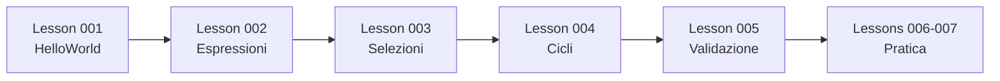

# 📘 Recap - Lezioni di Ripasso


**Percorso:** `01_Fundamentals_Examples/Recap/`

---

## 📋 Panoramica

Lezioni di ripasso che coprono i concetti fondamentali della programmazione Java. Queste lezioni servono come revisione completa di tutti i concetti base prima di procedere con argomenti avanzati.

---

## 📚 Lezioni Incluse

### Lesson 001 - HelloWorld

<details>
<summary><b>Clicca per espandere</b></summary>

**Argomenti Trattati:**
- Struttura base di un programma Java
- Istruzioni di output
- Il tuo primo programma Java

**Concetti Chiave:**
```java
public class HelloWorld {
    public static void main(String[] args) {
        System.out.println("Hello, World!");
    }
}
```

</details>

---

### Lesson 002 - PrimeEspressioni

<details>
<summary><b>Clicca per espandere</b></summary>

**Argomenti Trattati:**
- Variabili e tipi di dati
- Espressioni aritmetiche
- Calcoli di base

**Concetti Chiave:**
- `int`, `double`, `String`
- Operatori: `+`, `-`, `*`, `/`, `%`
- Assegnazione e inizializzazione

</details>

---

### Lesson 003 - EsempiSelezioni

<details>
<summary><b>Clicca per espandere</b></summary>

**Argomenti Trattati:**
- Istruzioni condizionali (if/else)
- Logica booleana
- Processo decisionale

**Concetti Chiave:**
```java
if (condizione) {
    // codice se vero
} else {
    // codice se falso
}
```

</details>

---

### Lesson 004 - EsempioCiclo

<details>
<summary><b>Clicca per espandere</b></summary>

**Argomenti Trattati:**
- Introduzione alle strutture di ciclo
- Concetti base di iterazione

**Concetti Chiave:**
- Cicli for, while, do-while
- Variabili di controllo
- Pattern di iterazione

</details>

---

### Lesson 005 - EsempioRettangolo

<details>
<summary><b>Clicca per espandere</b></summary>

**Argomenti Trattati:**
- Calcolatore area rettangolo
- Validazione input con cicli do-while
- Validazione dati (solo valori positivi)
- Uso pratico dei cicli per la validazione

**Esempio di Codice:**
```java
double base, altezza;
do {
    base = Console.readDouble("Inserisci la base: ");
    if (base <= 0) {
        System.out.println("Errore: la base deve essere positiva!");
    }
} while (base <= 0);

do {
    altezza = Console.readDouble("Inserisci l'altezza: ");
    if (altezza <= 0) {
        System.out.println("Errore: l'altezza deve essere positiva!");
    }
} while (altezza <= 0);

double area = base * altezza;
System.out.println("Area del rettangolo: " + area);
```

</details>

---

### Lessons 006-007

<details>
<summary><b>Clicca per espandere</b></summary>

**Argomenti Trattati:**
- Esercizi di ripasso aggiuntivi
- Rinforzo dei concetti fondamentali
- Applicazioni pratiche

</details>

---

## 🎯 Scopo del Modulo

Queste lezioni servono come **revisione completa** di tutti i concetti Java di base prima di passare ad argomenti avanzati.

---

## 🔑 Argomenti Chiave Ripassati

<table>
<tr>
<td width="50%">

### 📝 Fondamenti
- Struttura del programma
- Variabili e tipi di dati
- Operazioni aritmetiche
- Input/Output

</td>
<td width="50%">

### 🔄 Strutture di Controllo
- Istruzioni condizionali
- Cicli
- Validazione input
- Logica decisionale

</td>
</tr>
</table>

---

## 💡 Concetti Evidenziati

### Validazione Input con Do-While

Il **do-while loop** è perfetto per la validazione input perché:
- Esegue almeno una volta (raccoglie sempre l'input)
- Ripete finché l'input è invalido
- Fornisce feedback immediato all'utente

```java
int numero;
do {
    numero = Console.readInt("Inserisci un numero positivo: ");
    if (numero <= 0) {
        System.out.println("Errore! Riprova.");
    }
} while (numero <= 0);
```

---

## 🎓 Competenze Consolidate

Dopo questo modulo di ripasso, avrai consolidato:

- ✅ Sintassi base di Java
- ✅ Dichiarazione e uso di variabili
- ✅ Operazioni aritmetiche e logiche
- ✅ Strutture condizionali
- ✅ Cicli e iterazioni
- ✅ Validazione input
- ✅ Best practices di programmazione

---

## 🚀 Quando Usare Questo Modulo

Utilizza queste lezioni di ripasso quando:
- Hai bisogno di rinfrescare i concetti base
- Stai preparando un esame
- Vuoi verificare la tua comprensione
- Passi da un argomento avanzato e vuoi rivedere le basi

---

## 📊 Percorso di Studio Suggerito



---

## 👨‍💻 Autore

**Hacman Viorica Gabriela**
- 🎓 Generation Italy - Java Full Stack Developer
- 📧 hacmanvioricagabriela@gmail.com
- 🐙 GitHub: [@vhacman](https://github.com/vhacman)

---

<div align="center">

### ⭐ Hai completato il ripasso? Sei pronto per argomenti avanzati!

**Ricorda:** La ripetizione è la madre dell'apprendimento!


</div>
